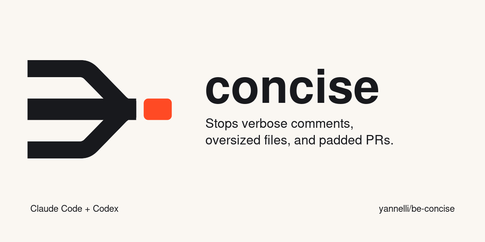

# concise

Concise is a Claude Code and Codex plugin that catches the agent's own verbosity before a write or GitHub command runs. It also filters test-runner output before the agent reads it.

New here? Start with [plugins/concise/README.md](plugins/concise/README.md).

## What it checks

- Comment blocks longer than 2 lines in `Write`, `Edit`, `MultiEdit`, and Codex `apply_patch` additions
- New files longer than 300 lines
- Inline `gh pr` and `gh issue` bodies with more than 1 prose paragraph or more than 3 sentences in a paragraph
- Em dashes and 44 categories of AI writing patterns, both off until you turn them on
- Output from pytest, `go test`, npm test, Jest, and Vitest; the full output remains available at `/tmp/claude-test-last.log`

Structured GitHub bodies that use headings and lists are allowed. A denied call includes the exact limit and location. After 2 denied retries for the same target, Concise permits the next attempt and flags it.

## Install

Git, Node.js, Bash, `jq`, `realpath`, and core Unix tools must be available on `PATH`.

### Claude Code

Run these commands inside Claude Code:

```text
/plugin marketplace add https://github.com/yannelli/be-concise
/plugin install concise@be-concise
```

Review the hooks and choose an installation scope. If the install summary requests it, run `/reload-plugins`.

[Claude Code plugin documentation](https://code.claude.com/docs/en/discover-plugins)

### Codex

Codex CLI 0.152.0 or newer is the supported baseline.

```sh
codex plugin marketplace add yannelli/be-concise
codex plugin add concise@be-concise
```

Start a new Codex session, run `/hooks`, and review and trust each `concise` hook under both `PreToolUse` and `Stop`. Codex asks for review again when a hook definition changes.

For automation that already validates its hook sources:

```sh
codex exec --dangerously-bypass-hook-trust "<prompt>"
```

The bypass applies to that invocation and does not save trust.

[Codex plugin documentation](https://developers.openai.com/plugins/build/plugins#add-a-marketplace-from-the-cli)

## Documentation

- [plugins/concise/README.md](plugins/concise/README.md): the entry point. Quick start, what each check does, the 8 presets, and the escape hatches.
- [plugins/concise/docs/configuration.md](plugins/concise/docs/configuration.md): every config key with its default, the 5 config layers, `mode`, `allowList`, `bypass`, and logging.
- [plugins/concise/docs/categories.md](plugins/concise/docs/categories.md): all 44 AI writing categories with an example, a fix, the presets, and the scopes.
- [plugins/concise/docs/environment.md](plugins/concise/docs/environment.md): every `BEC_` variable and 3 worked scenarios, including a cloud agent with no config file.
- [plugins/concise/docs/packs.md](plugins/concise/docs/packs.md): the pack file format, the 3 pattern kinds, `detect(text, ctx)`, and the validator and renderer commands.

## Web console

Run from this repository with Node.js 24:

```sh
node bin/concise-web.mjs
```

Or install the command globally from this checkout:

```sh
npm install -g .
concise-web --cwd /path/to/project
```

The command starts a localhost server on an available port and opens the browser. Use `--port 4317` to select a port or `--no-open` to print the URL without opening it. `npm run web` also starts the console from the repository.

`concise-web --all` serves every project the hooks have registered under `~/.config/concise/projects`, with a project switcher in the sidebar. Each hook call registers its project there and appends its record to `~/.local/state/concise/projects/<hash>/records.jsonl`, so the hub shows history from before it started and keeps working while it is down. Set `"monitor": { "persist": false }` or `BEC_MONITOR_PERSIST=0` to keep the registry entry without the record file.

The console edits user and project configuration, shows the effective settings and environment overrides, and tests pasted text through the hooks. The Rules page switches packs on and off, adds a pack from an https URL, a local path, or pasted JSON, checks packs installed from a URL and the plugin itself for updates, and removes packs it installed. Pack management is described in [plugins/concise/docs/packs.md](plugins/concise/docs/packs.md). It shows matches, hook decisions, timings, and full JSON responses. Repeat an attempt to test confirmation and retry limits, or reset the playground session.

The playground previews Bash command rewrites. It does not run the pasted command. It uses separate retry state and leaves test configuration changes unsaved until you save a configuration layer.

Live activity captures hook requests and responses for the selected project while the console runs, with filtering, JSON export, and counts for the retained records. It keeps up to 500 records per project within 16 MiB in memory. Stop the server to discard them, and clear a project's history to truncate its record file. Capture requires this version of the plugin in the agent host; reload the plugin and review the changed Bash hook definition after updating. Other environment overrides in the agent process still apply to its hooks.

The URL contains a local access token. Configuration saves detect intervening file edits. `Ctrl+C` stops the server and removes its capture registration.

## Control test output

Bypass filtering for one command:

```sh
NOFILTER=1 pytest tests/
```

Adjust the output cap, match pattern, context, or tail length:

```sh
FILTER_LINES=300 FILTER_PATTERN='FAIL|timeout' FILTER_CONTEXT=10 FILTER_TAIL=20 go test ./...
```

Persistent defaults can live in `~/.claude/test-filter.conf` or `~/.codex/test-filter.conf`.

## Development

See [CONTRIBUTING.md](CONTRIBUTING.md) for the `dev` → `main` workflow, Conventional Commits, and automated semantic releases.

```sh
node plugins/concise/test/run-tests.mjs
```

The suite runs the Claude Code cases, then `plugins/concise/test/codex-tests.mjs`, which feeds `apply_patch` payloads in the shape Codex 0.152 sends, and then a self-check that writes every file in the plugin through the hook under the `ryan` preset.

## Maintainer

[Ryan Yannelli (@yannelli)](https://github.com/yannelli)

## License

[MIT](LICENSE)
